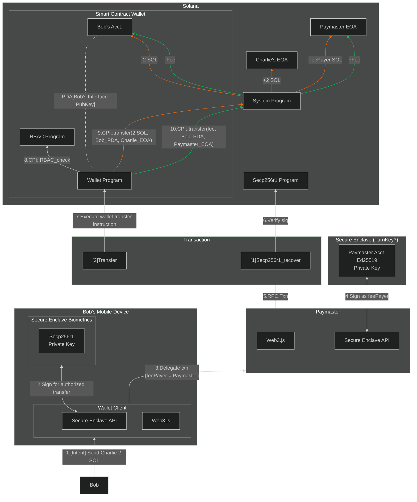

```mermaid
flowchart TB
 subgraph s2["Secure Enclave (SE)"]
        n13["Paymaster Acct. <br>Private Key"]
        n4["Bob's Interface<br>Private Key"]
  end
 subgraph s3["Bob's Wallet Client"]
        n5["SE API"]
        n15["Web3.js"]
  end
 subgraph s1["Smart Contract Wallet"]
        n2["Program"]
        n11{"Is Authorized <br>Interface?"}
        n1["Bob's Acct.<br>"]
  end
 subgraph s4["Solana"]
        s1
        n7["Charlie's EOA"]
        n10["System Program"]
        n12["Paymaster EOA"]
  end
 subgraph s5["Paymaster"]
        n9["Web3.js"]
  end
    n8["Bob"] -- 1.Send Charlie 2 SOL --> s3
    n5 -- 2.Sign for authorized transfer --> n4
    n11 -- YES --> n2
    n2 -- 5.CPI::transfer(2 SOL, Bob_PDA, Charlie_EOA) --> n10
    n2 -- 6.CPI::transfer(fee, Bob_PDA, Paymaster_EOA) ---> n10
    n2 -. PDA[Bob's Interface PubKey] .- n1
    n10 -- -2 SOL --> n1
    n10 -- +2 SOL --> n7
    s3 -- 3.Fwd Txn (feePayer=Paymaster) --> s5
    n2 -- 4.RBAC check --> n11
    n9 -- Sign Txn --> n13
    n9 -- transfer(2 SOL, Charlie's_EOA, feePayer=BobPDA) ---> n2
    n10 -- -feePayer SOL --> n12
    n10 -- -Fee ---> n1
    n10 -- +Fee --> n12
    style n11 stroke:#FFD600,fill:#444000
```

## Sequence

1. Bob creates an intent via wallet UI to send Charlie 2 SOL.
2. The wallet client uses the secure enclave’s API to authorize signing the intent.
3. The wallet client formulates a txn with wallet program’s `transfer` ixn. 
    1. The txn gets fwded to the paymaster for handling feePayer responsibilities. 
    2. The txn is executed, invoking the corresponding program. 
4. The program’s RBAC ensures the interface account is authorized for transfer operations (along with optional transfer amount limits).
    1. Assuming RBAC succeeds…
5. CPI to SystemProgram for transferring the lamports to Charlie’s EOA.
6. CPI to SystemProgram for refunding the paymaster from sender’s account (Bob’s PDA).

## TODO
- [ ] Add RBAC check to transfer ixn.  
- [ ] Add SPL Token support.
- [ ] Implement biometric passkeys (secp256r1) once the syscall becomes available. See concept below:

